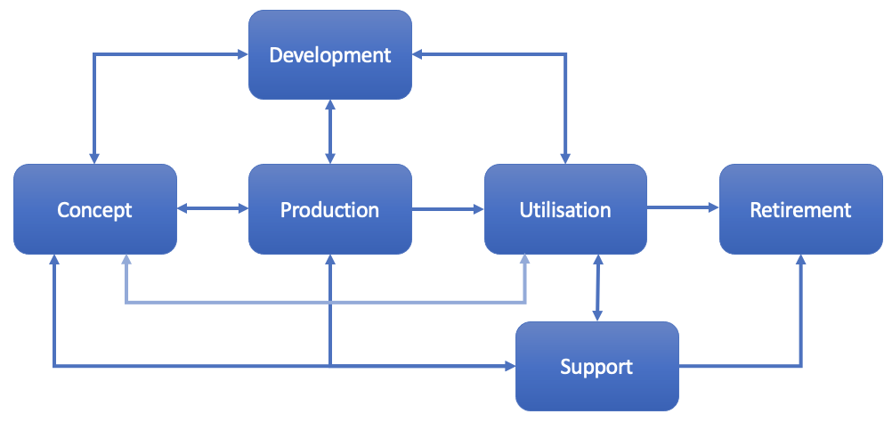

# Lifecycle and development models

*Under development*

## System lifecycles

Because science, technology, society and customer requirements all evolve over time, every
engineered system has a lifecycle. It starts as a concept, moves through design and 
development, spends most of its time being used, and is finally retired. Dividing a system
lifecycle into stages helps with planning, provisioning, operating and supporting the SOI.
A lifecycle model helps an organisation to make appropriate decisions and to manage the risks
related to the development and use of systems by providing clear thresholds, sometimes called
*gateways*.

ISO24748-1 defines six standard lifecycle stages as shown in Fig. 1.

*Fig. 1: Lifecycle stages [ISO24748-1](https://doi-org.napier.idm.oclc.org/10.1109/IEEESTD.2018.8526560)*

The progression from one lifecycle stage to another is not linear or predetermined. ISO24748-1 provides 
some example transitions as shown in Fig. 2 with the following decision options at each stage.

* Begin subsequent stage or stages
* Continue this stage
* Go to or restart a preceding stage
* Hold project activity
* Terminate project

*Fig. 2: Lifecycle stage transitions [ISO24748-1](https://doi-org.napier.idm.oclc.org/10.1109/IEEESTD.2018.8526560)*

ISO24748-1 identifies five common principles associated with system lifecycle management:

1. A system progresses through specific stages during its life.
2. Enabling systems should be available for each stage in order to achieve the outcomes of the stage.
3. At specific life cycle stages, attributes, such as producibility, usability, supportability and
disposability should be specified and designed into a system.
4. Progression to another stage requires satisfaction of exit criteria of the current stage and possibly
entrance criteria for the following stage or stages.
5. Exit criteria are usually based on satisfactory outcomes of the stage being completed and may
include demonstrable readiness to execute the processes in the subsequent stage or stages.

The concept of exit criteria is very important for ensuring the quality of a system. At the end of a 
software engineering project, for example, the system may only move from the development stage to the 
utilisation stage if pre-defined user acceptance criteria are met. This is a particularly important
transition for any development project since it represents the completion of the development work. As such,
it has its own name, often being referred to as *deployment*. Checks against standard criteria can be 
performed within stages as well to safeguard the quality of the work in progress.

The purpose of ISO24748-1 is to provide a common framework for the description and discussion of
system lifecycles; it does not attempt to dictate how a particular team or organisation should arrange
its lifecycle stages, or indeed which ones need to be implemented. A further complication is that there
are other terms for some of the stages mentioned in the standard. The development and production stages 
are often conflated, for example, so that a composite development stage also includes the building,
inspection and testing of a system. The support and utilisation stages are often conflated as well with
the resulting composite stage referred to as the *operation and maintenance* stage. The idea is that 
the work of building the system is complete, and the responsibility of the producer now shifts to 
maintaining the system in use. Confusingly, this stage may also be referred to as the production stage 
which is in direct conflict with the nomenclature defined in the standard.

 For a deeper understanding of the system lifecycle stages discussed above, please review the 
[ISO24748-1](https://doi-org.napier.idm.oclc.org/10.1109/IEEESTD.2018.8526560) standard itself which is 
relatively short and easy to read.

## Development project lifecycles

## Projects

[O'Regen, 2022, Ch. 4](https://link-springer-com.napier.idm.oclc.org/chapter/10.1007/978-3-031-07816-3_4)

You have probably heard of the Software Development Lifecycle (SDLC). Most books
on software development refer to the SDLC as if it is a single definitive 
structure that can be applied in every case. However, that is not the case. 
There are multiple ways of understanding and organising the lifecycle of a 
software development project, and it is important to understand the options
available with their advantages and disadvantages so that you can make 
appropriate choices.

[ISO/IEC/IEEE 15288:2023](https://doi-org.napier.idm.oclc.org/10.1109/IEEESTD.2023.10123367)

[O'Regen, 2022, Ch. 1](https://link-springer-com.napier.idm.oclc.org/chapter/10.1007/978-3-031-07816-3_1)

[Stephens, 2022, Ch. 17](https://learning.oreilly.com/library/view/beginning-software-engineering/9781119901709/c17.xhtml)

## Agile

[Stephens, 2022, Ch. 18](https://learning.oreilly.com/library/view/beginning-software-engineering/9781119901709/c18.xhtml)

[ISO26515-2018](https://doi.org/10.1109/IEEESTD.2018.8584455)

## Environments

## Deployment

[Stephens, 2022, Ch. 14](https://learning.oreilly.com/library/view/beginning-software-engineering/9781119901709/c14.xhtml)

## Links

* [ISO/IEC/IEEE 15288:2023](https://doi-org.napier.idm.oclc.org/10.1109/IEEESTD.2023.10123367)
* [ISO24748-1](https://doi-org.napier.idm.oclc.org/10.1109/IEEESTD.2018.8526560)
