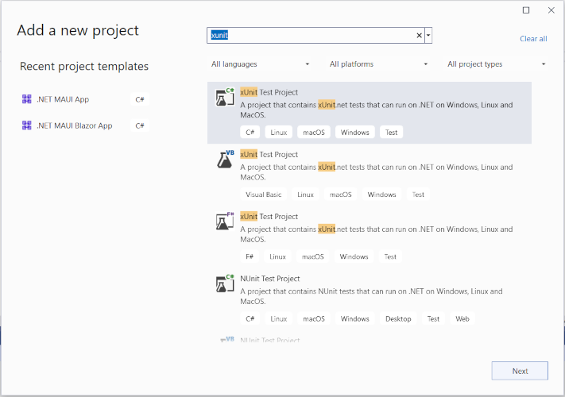

# Troubleshooting

Common problems and their solutions will be listed here. Use the page search facility to
see whether your issue is in the list. If you find a solution to a problem that might affect
other people, please ask for it to be added to this page.

<details>
<summary>MAUI project not listed in VS `create project` dialog</summary>

This [SO post](https://stackoverflow.com/questions/70507822/cant-find-net-maui-in-the-list-of-vs) 
provides a solution.

If the `dotnet` command is not recognised by your operating system, the containing directory is
not in your system path. To work around this, find out which directory `dotnet` is in, `cd` to
that directory and run the command from there.

If the .NET MAUI is already installed using Visual Studio Installer, uninstall it together with .NET and 
follow these steps:

1. Delete all files and folders in `C:/Program Files (x86)/dotnet`
2. Run the command `dotnet new install Microsoft.Maui.Templates`
3. Install .NET MAUI and .NET again using Visual Studio Installer

</details>

<details>
<summary>Setting up unit tests in Visual Studio</summary>

This is not as simple as it first appears because there are several unit test frameworks 
available with different dependencies. .NET MAUI requires the .NET 7.0 build framework and
so we need a test framework that is compatible. These notes explain how to install the 
[xUnit](https://xunit.net/) framework and use it to create a test.

### Create the test project

Open the project you wish to test in Visual Studio. In the Solution Explorer, right-click
on the solution (topmost) element and select _**Add/New Project...**_ from the context menu.

Type `xunit` into the search box and select the xUnit Test Project for C# as shown below.



Give the project an appropriate name and select the .NET 7.0 build framework before clicking
the *Create* button. As soon as the new project appears, you can right-click it and select
_**Run Tests**_ from the context menu. An empty test has been created by default which 
should pass.

### Link the app and test projects

The next step is to add the main project as a dependency. Right-click the *Dependencies*
folder and select _**Add Project Reference...**_. When the dialog appears, click the
checkbox next to the name of your original project and click *OK*.

### Update the app project's `.csproj` file

In the app project's `.csproj` file, you should see lines similar to the snippet below

```xml
<ProprtyGroup>
    <TargetFrameworks Condition="$([MSBUILD]::IsOSPlatform('windows'))">$(TargetFrameworks);net7.0-windows10.0.19041.0</TargetFrameworks>
    <OutputType>Exe</OutputType>
```

Your copy of the file may have an additional line immediately after the `<PropertyGroup>` 
element. If so, add `net7.0` to the list of target frameworks. Otherwise, add the line as 
shown below.

Your copy may have some comment lines before the `<OutputType>` element - just ignore these.

```xml
<ProprtyGroup>
    <TargetFrameworks>net7.0</TargetFrameworks>
    <TargetFrameworks Condition="$([MSBUILD]::IsOSPlatform('windows'))">$(TargetFrameworks);net7.0-windows10.0.19041.0</TargetFrameworks>
    <OutputType>Exe</OutputType>
```

There is one more change to this file, and that is to modify the output type. Currently,
the project is configured to generate a `.exe` file, but the test requires a `.dll`. Because
`.dll` is rhe default, we can create that output type when running a test and a `.exe` 
otherwise by adding a condition to the `<OutputType>` element as shown below.

```xml
<ProprtyGroup>
    <TargetFrameworks>net7.0</TargetFrameworks>
    <TargetFrameworks Condition="$([MSBUILD]::IsOSPlatform('windows'))">$(TargetFrameworks);net7.0-windows10.0.19041.0</TargetFrameworks>
    <OutputType Condition="'$(TargetFramework)' != 'net7.0'">Exe</OutputType>
```

Finally, add an additional line after the `<OutputType>` element as shown below. The rest
of the file remains the same.

```xml
<ProprtyGroup>
    <TargetFrameworks>net7.0</TargetFrameworks>
    <TargetFrameworks Condition="$([MSBUILD]::IsOSPlatform('windows'))">$(TargetFrameworks);net7.0-windows10.0.19041.0</TargetFrameworks>
    <OutputType Condition="'$(TargetFramework)' != 'net7.0'">Exe</OutputType>
    <UseMaui>true</UseMaui>
```

### Add required dependencies to the app project

xUnit needs additional reqources to be able to access the MAUI elements. Right-click the
app project's *Dependencies* folder in the solution explorer and select _**Manage NuGet
Packages...**_. Use the search field to locate and add the following two packages:

> * **Microsoft.Maui.Dependencies**
> * **Microsoft.Maui.Extensions**

You will need to reload the project for the changes to take effect (restarting Visual
Studio will do this). Afterwards, you should be able to reference code from the app
project in your unit tests.

</details>
